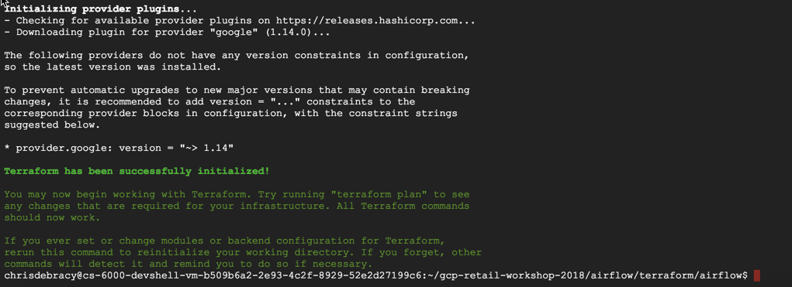
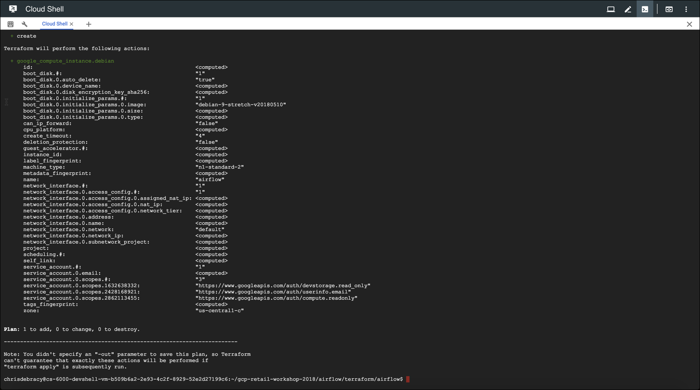
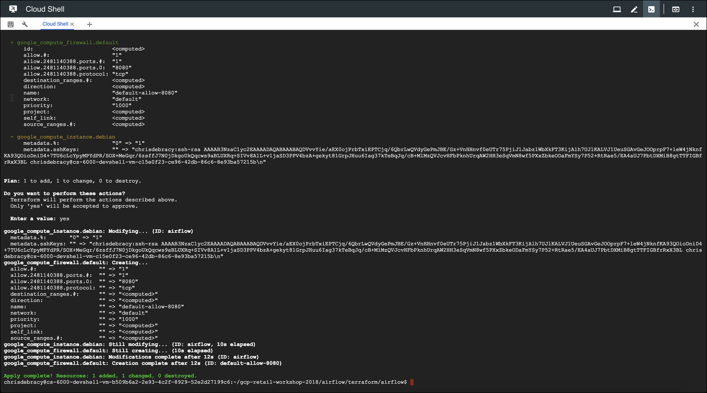
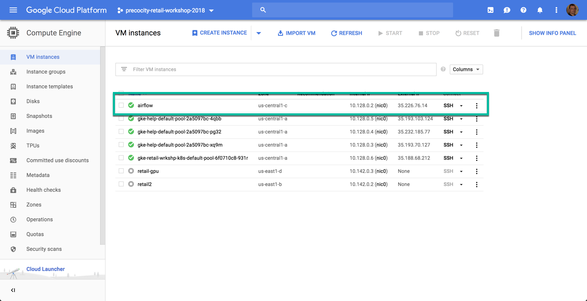
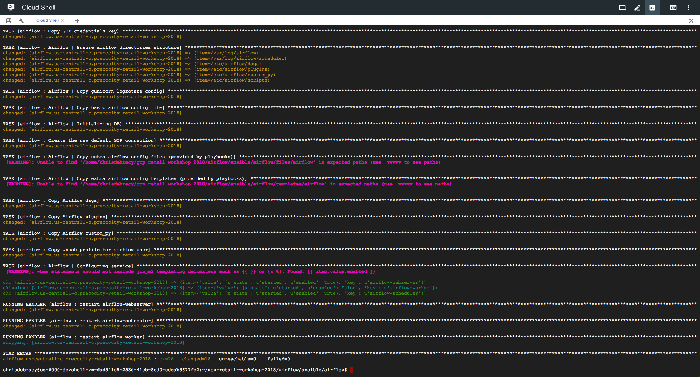

# Airflow Hands-On Lab
## Overview
In the previous BigQuery labs you ran an number of DataFlow jobs manually. In a production environment you would want to automate these jobs on a schedule. Airflow is the tool of choice for automating ETL jobs, due to its rich set of built-in operators, create sophisticated orchestration for the movement of data and an ability to create custom operators to extend its functionality.

This lab is designed to demonstrate how to use Terraform to create a compute instance and then configure an Airflow instance using Ansible.

Precocity uses Terraform for overall infrastructure deployment and Ansible for the installation and configuration management of resources.

## Hands-On
### Pre-Requisites
* Cloud Shell
* `git clone https://github.com/precocity/gcp-retail-workshop-2018.git`
* `cd ~gcp-retail-workshop-2018/scripts`
* `./02_variableSubstitution.sh`

>Note: Unless otherwise explicitly stated, all the commands below are to be executed in Cloud Shell as-is. If you have already run the `git clone` command, it is not necessary to do it again.
> Any commands previously entered during the BigQuery labs can be ignored.

---
### Lab 1: Creating the Airflow Instance with Terraform

Expected Time: 10 mins

In this section you will configure Terraform and create a service account key for use with Ansible.

**Step 1:**
Configuring SSH and Downloading Terraform

First, run the following command:

`gcloud compute config-ssh`

The following content will appear:

>WARNING: The public SSH key file for gcloud does not exist.
>WARNING: The private SSH key file for gcloud does not exist.
>
>WARNING: You do not have an SSH key for gcloud.
>WARNING: SSH keygen will be executed to generate a key.
>This tool needs to create the directory [/home/wils_jacob/.ssh] before
> being able to generate SSH keys.
>
>Do you want to continue (Y/n)?

Type `Y` and Enter to continue. When prompted to enter a passphrase, just press Enter. You will do that twice. When complete, your cloud shell will display:

>Generating public/private rsa key pair.
>Enter passphrase (empty for no passphrase):
>Enter same passphrase again:
>Your identification has been saved in /home/wils_jacob/.ssh/google_compute_engine.
>Your public key has been saved in /home/wils_jacob/.ssh/google_compute_engine.pub.
>The key fingerprint is:
>SHA256:HI5Zb8o34A97wDG+QK1LjOqKS0yQmjLXoTz7A5shnnU wils_jacob@cs-6000-devshell-vm-0adf3408-f5f9-45ad-9ac9-ab073a6d05a1
>The key's randomart image is:
>+---[RSA 2048]----+
>|                 |
>| .               |
>|o   .  .o        |
>|oo o ..*+o       |
>|=.= .+o+Soo      |
>|=oo+.E=o++       |
>|.++*.. o=oo      |
>|oo+.. . .=..     |
>|++. ..  ...      |
>+----[SHA256]-----+
>Updating project ssh metadata...|Updated [https://www.googleapis.com/compute/v1/projects/retail-workshop-walkthrough-1].
>Updating project ssh metadata...done.
>WARNING: No host aliases were added to your SSH configs because you do not have any instances. Try running this command again after creating some instances.

The SSH key created here will be used by Terraform when deploying the Airflow instance. Now you can navigate to the Terraform folder.

* `cd gcp-retail-workshop-2018/airflow/terraform/airflow`

This is the folder from which you will install and configure Terraform. Run the following commands in order:

* `wget https://releases.hashicorp.com/terraform/0.11.7/terraform_0.11.7_linux_amd64.zip`
* `unzip terraform_0.11.7_linux_amd64.zip -d .`
* `./terraform -v`

>The output from the last command should display something similar to below:
>
>`Terraform v0.11.7`.

You have successfully installed Terraform.

**Step 2:**
Creating a Service Account

In this lab You will create a service account with editor permissions that Terraform and Ansible will use to create and configure GCP resources needed for Airflow. Enter the following:

`$ gcloud iam service-accounts create airflow`

If prompted to enable the API, press Y to continue. The output from the command should display:

>
>Created service account [airflow].
>

These next two commands will create the credentials needed to communicate with the Airflow instance and add the appropriate role to the service account that you just created.

'gcloud iam service-accounts keys create ~/gce-airflow-key.json --iam-account=airflow@$GOOGLE_CLOUD_PROJECT.iam.gserviceaccount.com'

The output should look similar to below:

>`created key [230bc3e5da71391ffd8554a7f1a2a661d51a9045] of type [json] as [/home/chrisdebracy/gce-airflow-key.json] for [airflow@precocity-retail-workshop-2018.iam.gserviceaccount.c
om]`

Now enter:

`gcloud projects add-iam-policy-binding $GOOGLE_CLOUD_PROJECT  --member serviceAccount:airflow@$GOOGLE_CLOUD_PROJECT.iam.gserviceaccount.com --role roles/editor`

>The output displayed will be a list of members and their roles for the project.

**Step 3:**
Running Terraform

The next commands will initialize Terraform, create the deployment plan and then apply that plan to create your Airflow instance.

If you're not in the `gcp-retail-workshop-2018/airflow/terraform/airflow` folder, change to it now:

`cd ~/gcp-retail-workshop-2018/airflow/terraform/airflow`

Run the init command:

'./terraform init'

Your cloud shell should look similar to the screen below:

Now, run the next command to create the deployment plan:

`./terraform plan`

Your shell should look similar to the following:

Now you can deploy your Airflow instance. Please enter the following:

`./terraform apply`

When prompted to continue, enter `yes` and press Enter.

From the Google Cloud Console, navigate to the Compute Engine | VM Instances page and you will see an `airflow` instance created.

**Step 5:**
Verify SSH Access

Part of the Terraform deployment for Airflow copies your local SSH key for your account to the Airflow instance. This last set of commands will configure and verify the ssh access.

`gcloud compute config-ssh`

The output should look similar to the that below:

>You should now be able to use ssh/scp with your instances.
>For example, try running:
>  $ ssh retail2.us-east1-b.precocity-retail-workshop-2018

Enter the following, substituting your name and project id as needed. This is required to initialize the ssh connectivity to the airflow instance for Ansible.

`ssh $USER@airflow.us-central1-c.$GOOGLE_CLOUD_PROJECT`

The next prompt will appear:

>The authenticity of host 'compute.937945848083147541 (35.226.76.14)' can't be established.
>ECDSA key fingerprint is SHA256:1CMAxEisZL17ammaMOqMt4rIRIuGzHSX1SpFypbwVyE.
>Are you sure you want to continue connecting (yes/no)?

Enter `yes` to continue. The following will appear, along with the airflow prompt to indicate you are connected:

>Warning: Permanently added 'compute.937945848083147541' (ECDSA) to the list of known hosts.
>Linux airflow 4.9.0-6-amd64 #1 SMP Debian 4.9.88-1+deb9u1 (2018-05-07) x86_64
>The programs included with the Debian GNU/Linux system are free software;
>the exact distribution terms for each program are described in the
>individual files in /usr/share/doc/*/copyright.
>Debian GNU/Linux comes with ABSOLUTELY NO WARRANTY, to the extent
>permitted by applicable law.

To quit the airflow instance, type:

`exit`

---
### Lab 2: Installing Airflow with Ansible

Expected Time: 10 mins

In this section you will configure and run Ansible to deploy the Airflow application and artifacts onto the new airflow instance you created with Terraform.

**Step 1:**
Installing Ansible

The following commands will change to the Ansible folder from where you will perform the install of Ansible and the running of the playbook. A script that installs pip packages needs execute permissions set and then you will run the script to install Ansible.

`cd ~/gcp-retail-workshop-2018/airflow/ansible/airflow`
`. ./ansible_install.sh`

> Ansible requires sudo access to install and the binaries will not survive the exiting of Google Cloud Shell.
> The last command `. ./ansible_install.sh` needs the extra space between the two periods as it is setting environment variables that you want exposed to your current session.

When successful, your cloud shell should look similar to the screen below:

**Step 2:**
Running Ansible's Playbook

First, verify you have connectivity to the airflow instance:

`ansible all -m ping`

The output should look similar to the following:

>airflow.us-central1-c.precocity-retail-workshop-2018 | SUCCESS => {
>    "changed": false,
>    "ping": "pong"
>}

If the text isn't green and "SUCCESS" not shown, check your previous steps. This command needs to work before proceeding. If all is well, you can run the Ansible command to install the Playbook:

`ansible-playbook provision.yml`

> Answer `yes` if prompted to authenticate the host.

The content that displays is extensive and spans more than one screen. You will see several warnings that you can ignore.

Navigate to the Compute Engine | VM Instances page from Google Cloud Console and you will see the external IP of your airflow instance.

Copy the IP followed by `:8080` into a browser window and press Enter. The Airflow GUI will appear.

Congratulations! You have installed and configured an Airflow instance on GCP using Terraform and Ansible. The next lab will walk you through a little of how Airflow works.

___
### Lab 3: Using Airflow

**Step 1:***
Airflow GUI

By default Airflow pauses new DAGs that have been deployed.

