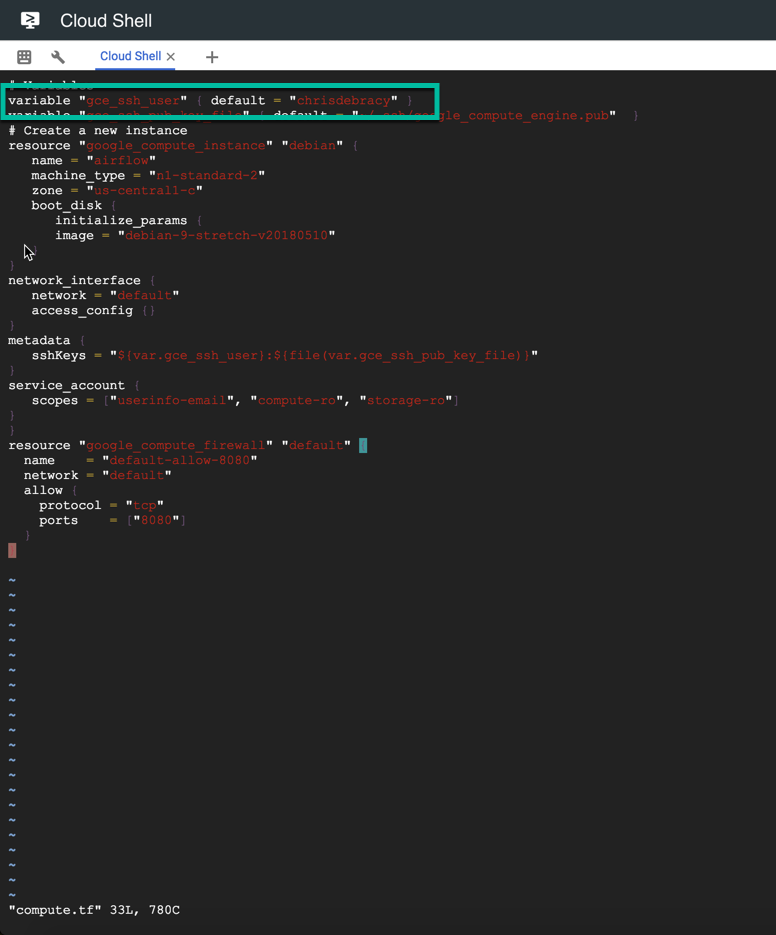

# Airflow Hands-On Lab
## Overview
This lab is designed to demonstrate how to use Terraform to create a compute instance and then configure an Airflow instance using Ansible.

Precocity uses Terraform for overall infrastrucutre deployment and Ansible for the installation and configuration management of resources.

## Hands-On
### Pre-Requisites
* Cloud Shell
* `git clone https://github.com/precocity/gcp-retail-workshop-2018.git`

>Note: Unless otherwise explicitly stated, all the commands below are to be executed in Cloud Shell as-is. If you have already run the `git clone` command, it is not necessary to do it again.

>Note: Once you are done with all the exercises, please go through the last Cleanup exercise to review and make sure any running resources are terminated.

---
### Exercise 1: Creating the Airflow Instance with Terraform

Expected Time: 5 mins

In this section you will configure Terraform and create a service account key for use with Ansible.

**Step 1:**
Downloading Terraform

From Google Cloud Shell run the following commands:

* `gcloud config set project [PROJECT_ID]`

Replace [PROJECT_ID] with your project name. From this point on we can reference your project name using the $DEVSHELL_PROJECT_ID environment variable.

* `cd gcp-retail-workshop-2018/airflow/terraform/airflow`

This is the folder from which you will install and configure Terraform. Run the following commands in order:

* `wget https://releases.hashicorp.com/terraform/0.11.7/terraform_0.11.7_linux_amd64.zip`
* `unzip terraform_0.11.7_linux_amd64.zip -d .`
* `./terraform -v`

The output from the last command should display `Terraform v0.11.7`.

**Step 2:**
Creating a Service Account

You will create a service account with editor permissions that both Terraform and Ansible can use to create and configure GCP resources needed for Airflow. Enter the following:

`$ gcloud iam service-accounts create airflow`

If prompted to enable the API, press Y to continue. The output from the command should display:

`Created service account [airflow].`

These next two commands will create the credentials needed to communicate with the Airflow instance and add the appropriate role to the service account:

'gcloud iam service-accounts keys create ~/gce-airflow-key.json --iam-account=airflow@$DEVSHELL_PROJECT_ID.iam.gserviceaccount.com'

THe output should look similar to below:

`created key [230bc3e5da71391ffd8554a7f1a2a661d51a9045] of type [json] as [/home/chrisdebracy/gce-airflow-key.json] for [airflow@precocity-retail-workshop-2018.iam.gserviceaccount.c
om]`

Now enter:
`gcloud projects add-iam-policy-binding $DEVSHELL_PROJECT_ID  --member serviceAccount:airflow@$DEVSHELL_PROJECT_ID.iam.gserviceaccount.com --role roles/editor`

The output displayed will be a list of members and their roles for the project.

**Step 3:**
Configuring the Terraform Files

You will next edit the `provider.tf` file to include your project name:

`vi provider.tf`

Move the cursor to the project name and press `I` to put the editor into insert mode. Use the `DEL` key to delete the sample project name and enter your own. When complete, press `ESC` and `:wq` to save and quit the editor.

Now, edit the `compute.tf` file. This time you will edit the default user to your account name.

Move the cursor to the user name and press `I` to put the editor into insert mode. Use the `DEL` key to delete the sample user name and enter your own. When complete, press `ESC` and `:wq` to save and quit the editor.

**Step 4:**
Running Terraform

The next commands will initialize Terraform, create the deployment plan and then apply that plan to create your Airflow instance.

If you're not in the `gcp-retail-workshop-2018/airflow/terraform/airflow` folder, change to it now:

`cd ~/gcp-retail-workshop-2018/airflow/terraform/airflow`

Run the init command:

'./terraform init'

Your cloud shell should look similar to the screen below:

Now, run the next command to create the deployment plan:

`./terraform plan`

Your shell should look similar to the following:

It is time to deploy your Airflow instance. Please enter the following:

`./terraform apply`

When prompted to continue, enter `yes` and press Enter.

From the Google Cloud Console, navigate to the Compute Engine | VM Instances page and you will see an `airflow` instance created.

**Step 5:**
Verify SSH Access

Part of the Terraform deployment for Airflow is to copy the local SSH key for your account to the Airflow instance. This last set of commands will configure and verify the ssh access.

`gcloud compute config-ssh`

The output should look similar to the that below:

`You should now be able to use ssh/scp with your instances.
For example, try running:
  $ ssh retail2.us-east1-b.precocity-retail-workshop-2018`

Now enter the following, substituting your name and project id as needed:

`ssh $USER@airflow.us-central1-c.$DEVSHELL_PROJECT_ID`

The next prompt will appear:

`The authenticity of host 'compute.937945848083147541 (35.226.76.14)' can't be established.
ECDSA key fingerprint is SHA256:1CMAxEisZL17ammaMOqMt4rIRIuGzHSX1SpFypbwVyE.
Are you sure you want to continue connecting (yes/no)?`

Type `yes` and Enter to continue. The following content will appear, along with the airflow prompt to indicate you are connected:

`Warning: Permanently added 'compute.937945848083147541' (ECDSA) to the list of known hosts.
Linux airflow 4.9.0-6-amd64 #1 SMP Debian 4.9.88-1+deb9u1 (2018-05-07) x86_64
The programs included with the Debian GNU/Linux system are free software;
the exact distribution terms for each program are described in the
individual files in /usr/share/doc/*/copyright.
Debian GNU/Linux comes with ABSOLUTELY NO WARRANTY, to the extent
permitted by applicable law.
chrisdebracy@airflow:~$`

To quit the airflow instance, type `exit`.

