# Data Ingestion Hands-On Lab
## Overview
### Reference Architecture

### Data Model
*[To Be Added]*

*[Identify the tables that will be loaded using Batch approach vs Streaming approach]*

### Dataflow Templates
* [Overview](https://cloud.google.com/dataflow/docs/templates/provided-templates)
* [Source code](https://github.com/GoogleCloudPlatform/DataflowTemplates)
  - GCS Text to BigQuery
  - Pub/Sub to BigQuery
  - Pub/Sub to GCS Text

## Hands-On
### Pre-Requisites
* Cloud Shell
* `git clone https://github.com/precocity/gcp-retail-workshop-2018.git`
* `cd gcp-retail-workshop-2018/ingestion`

>Note: Unless otherwise explicitly stated, all the commands below are to be executed in Cloud Shell as-is.

>Note: Once you are done with all the exercises, please go through the last Cleanup exercise to review and make sure any running resources are terminated.

---

### Exercise 1: Creating BigQuery Tables

Expected Time: 5 mins

Let's create one BigQuery table using the `bq` command and create the rest in the same manner using a helper script.

**Step 1:**
Create a dataset using the command below:

`bq mk retail_demo_warehouse`

>After executing this command, you should see a success message indicating that the dataset has been successfully created.

**Step 2:** Create a BigQuery table, customer, using the schema definition in the codebase:

`bq mk --table retail_demo_warehouse.customer bigquery/schemas/customer-bq.json`

>After executing this command, you should see a success message indicating that the table has been successfully created.

**Step 3:** Verify whether the dataset and the table are appropriately created by navigating to BigQuery on the left nav of Google Cloud home page and then selecting the dataset and table on the BigQuery home page.<br/><br/>


**Step 4:** Let's go ahead and create the rest of the tables required using a helper script that's provided in the codebase which essentially executes step #2 for all the remaining tables:

`sh bigquery/scripts/create-bq-tables.sh`

>At this point all the tables will be created in the dataset in BigQuery. You can verify in the BigQuery home page.

---

### Exercise 2: Deploy Dataflow Jobs

Expected Time: 15 mins

Let's manually deploy both batch and streaming dataflow jobs using the Google provided templates to understand how they readily provide capabilities to address most common ingestion scenarios.

**Step 1:** Clone the Google provided Dataflow templates project:
```
cd ~/
git clone https://github.com/GoogleCloudPlatform/DataflowTemplates.git
cd DataflowTemplates
```

**Step 2:** Next, we will create a unique bucket in GCS to deploy our Dataflow code. The name of the bucket will be [your-project-id]-dataflow.

`gsutil mb gs://${GOOGLE_CLOUD_PROJECT}-dataflow`

>In the above command the environment variable $GOOGLE_CLOUD_PROJECT is readily available in the Cloud Shell and will be substituted automatically during execution.

**Step 3:** Build & deploy the GCS Text -> BigQuery Dataflow job:
```
mvn compile exec:java \
-Dexec.mainClass=com.google.cloud.teleport.templates.TextIOToBigQuery \
-Dexec.cleanupDaemonThreads=false \
-Dexec.args=" \
--project=${GOOGLE_CLOUD_PROJECT} \
--stagingLocation=gs://${GOOGLE_CLOUD_PROJECT}-dataflow/gcs-to-bigquery/staging \
--tempLocation=gs://${GOOGLE_CLOUD_PROJECT}-dataflow/gcs-to-bigquery/tmp \
--templateLocation=gs://${GOOGLE_CLOUD_PROJECT}-dataflow/gcs-to-bigquery/templates/FileToBigQuery.json \
--runner=DataflowRunner"
```
>You should see a "Build Successful" message upon successful deployment of the Dataflow job.
>**Note**: The very first execution of the build will take significantly longer than the rest of the builds below as Maven downloads all the dependencies to perform the build.

**Step 4:** Build & deploy the Pub/Sub -> BigQuery Dataflow job:
```
mvn compile exec:java \
-Dexec.mainClass=com.google.cloud.teleport.templates.PubSubToBigQuery \
-Dexec.cleanupDaemonThreads=false \
-Dexec.args=" \
--project=${GOOGLE_CLOUD_PROJECT} \
--stagingLocation=gs://${GOOGLE_CLOUD_PROJECT}-dataflow/pubsub-to-bigquery/staging \
--tempLocation=gs://${GOOGLE_CLOUD_PROJECT}-dataflow/pubsub-to-bigquery/tmp \
--templateLocation=gs://${GOOGLE_CLOUD_PROJECT}-dataflow/pubsub-to-bigquery/templates/PubSubToBigQuery.json \
--runner=DataflowRunner"
```
>You should see a "Build Successful" message upon successful deployment of the Dataflow job.

**Step 5:** Build & deploy Pub/Sub -> GCS Text Dataflow job:
```
mvn compile exec:java \
-Dexec.mainClass=com.google.cloud.teleport.templates.PubsubToText \
-Dexec.cleanupDaemonThreads=false \
-Dexec.args=" \
--project=${GOOGLE_CLOUD_PROJECT} \
--stagingLocation=gs://${GOOGLE_CLOUD_PROJECT}-dataflow/pubsub-to-gcs/staging \
--tempLocation=gs://${GOOGLE_CLOUD_PROJECT}-dataflow/pubsub-to-gcs/tmp \
--templateLocation=gs://${GOOGLE_CLOUD_PROJECT}-dataflow/pubsub-to-gcs/templates/PubSubToFile.json \
--runner=DataflowRunner"
```
>You should see a "Build Successful" message upon successful deployment of the Dataflow job.

**Step 6:** At this point all the required Dataflow jobs are deployed to GCS and you can verify by navigating to your bucket and the respective folders.

**Step 7:** Next step is to deploy application specific logic (parsing & transformations) that is required by the Dataflow jobs. There is helper script that copies the application specific code to GCS. Execute the following:
```
cd ~/gcp-retail-workshop-2018/ingestion
sh dataflow/scripts/deploy-app-code.sh
```

---

### Exercise 3: Batch Load

Expected Time: 20 mins

>**Note:**
>1. Be sure to enable Dataflow APIs in Google Cloud APIs page before proceeding.

In this exercise we will deploy a batch load job to load the customer data from GCS to the target customer table in BigQuery. We will be using the customer CSV file that's available in the workshop's bucket.

**Step 1:** Execute the following `gcloud` command to create a Dataflow job to load customer data:
```
gcloud dataflow jobs run customerLoad \
--gcs-location=gs://${GOOGLE_CLOUD_PROJECT}-dataflow/gcs-to-bigquery/templates/FileToBigQuery.json \
--parameters javascriptTextTransformFunctionName=transform,\
JSONPath=gs://${GOOGLE_CLOUD_PROJECT}-dataflow/schemas/customer.json,\
javascriptTextTransformGcsPath=gs://${GOOGLE_CLOUD_PROJECT}-dataflow/udfs/customer.js,\
inputFilePattern=gs://precocity-retail-workshop-2018-bucket/staged/customer/customer.*.csv,\
outputTable=retail_demo_warehouse.customer,\
bigQueryLoadingTemporaryDirectory=gs://${GOOGLE_CLOUD_PROJECT}-dataflow/gcs-to-bigquery/tmp
```
>Following the execution of the command you should see a log in the console similar to below:
```
createTime: '2018-06-08T19:59:11.516061Z'
currentStateTime: '1970-01-01T00:00:00Z'
id: 2018-06-08_12_59_10-6953731249770254557
location: us-central1
name: customerLoad
projectId: sample-project-id
type: JOB_TYPE_BATCH
```

**Step 2:** Navigate to the Dataflow page (GCP Home > Left Nav's Dataflow) to see the status of the job just submitted. Alternatively you can also get the job status from the command line using the command below:

`gcloud dataflow jobs list`


**Step 3:** In the Cloud Dataflow jobs page select the running job to see the job graph.


**Step 4:** You can also see the logs of each step by clicking the "Logs" icon on the job page.

>Note: As the customerLoad job executes, you can skip to Step 6 and kick off the rest of the Dataflow jobs. The first time execution of Dataflow job may take a while.

>:bulb: If the customerLoad is not progressing, check and make sure the Dataflow API settings are enabled for your project.

**Step 5:** Once the job completes, the status of the job will be marked "Succeeded" in the Dataflow home page.


**Step 6:** Now, let's go ahead and kick off other Dataflow jobs to load the rest of the tables. There's a helper script which has all the `gcloud` commands to kick off the batch load process for the rest of the tables.

```
cd ~/gcp-retail-workshop-2018/ingestion
sh dataflow/scripts/submit-batch-jobs.sh
```

**Step 7:** While the other jobs start to run, you can verify that the `customer` table has been successfully loaded in the BigQuery page as shown below.


**Step 8:** You can verify the other running jobs by navigating to the Dataflow jobs page and checking the status of each batch job.

>The key takeaway with this exercise is that we only built the batch ingestion Dataflow job only once. By templatizing / parameterizing it's execution we are able to reuse the same code for ingesting multiple batch sources.

---

### Exercise 4: Streaming

Expected Time: 20 mins

In this exercise we will deploy a streaming job to ingest streaming / realtime data into BigQuery. We will have two Dataflow jobs:
1. Streaming realtime data into BQ
2. Archiving realtime data into GCS

Below is the format of a sales event JSON message that we will be using for this exercise.

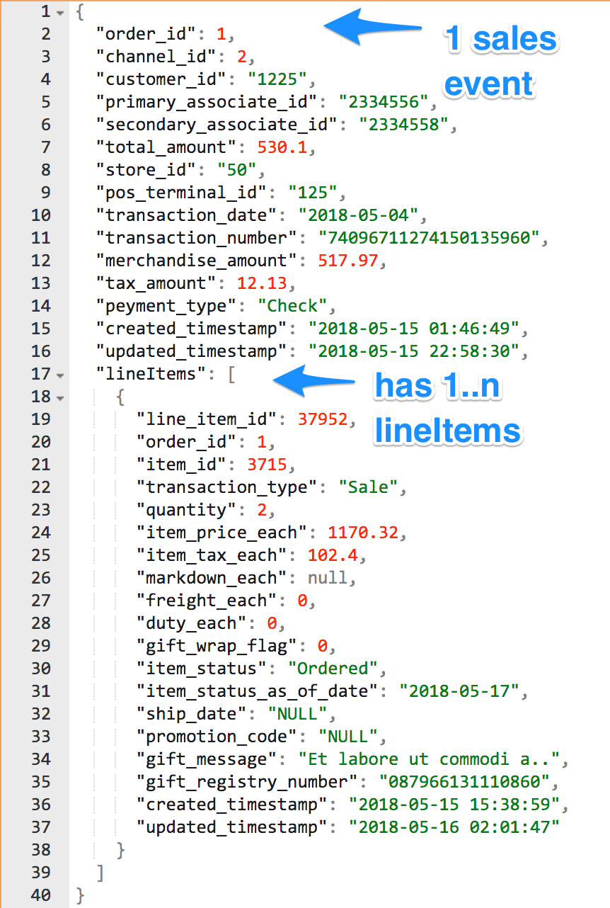

**Step 1:** Create a Pub/Sub topic to publish realtime sales events by executing the below statements:

```
gcloud pubsub topics create ${GOOGLE_CLOUD_PROJECT}-sales-events

# verify whether the topic has been created by executing:
gcloud pubsub topics list
```

**Step 2:** Next step, let's deploy the streaming Dataflow job that will subscribe to the PubSub topic and does streaming insert into the BigQuery sales table.

```
cd ~/gcp-retail-workshop-2018/ingestion

gcloud dataflow jobs run SalesEventsStreaming \
--gcs-location=gs://${GOOGLE_CLOUD_PROJECT}-dataflow/pubsub-to-bigquery/templates/PubSubToBigQuery.json \
--parameters inputTopic=projects/${GOOGLE_CLOUD_PROJECT}/topics/${GOOGLE_CLOUD_PROJECT}-sales-events,\
outputTableSpec=retail_demo_warehouse.sales_events
```

**Step 3:** Navigate to the Dataflow jobs page to notice the `SalesEventsStreaming` job running.

**Step 4:** Similarly, let's deploy the streaming Dataflow job that will subscribe to the PubSub topic and stores the raw JSON data into GCS for archival purposes.

```
gcloud dataflow jobs run SalesEventsRawStreaming \
--gcs-location=gs://${GOOGLE_CLOUD_PROJECT}-dataflow/pubsub-to-gcs/templates/PubSubToFile.json \
--parameters inputTopic=projects/${GOOGLE_CLOUD_PROJECT}/topics/${GOOGLE_CLOUD_PROJECT}-sales-events,\
outputDirectory=gs://${GOOGLE_CLOUD_PROJECT}-dataflow/raw/sales_events/,\
outputFilenamePrefix=sales-events-,outputFilenameSuffix=.json.txt
```

**Step 5:** Navigate to the Dataflow jobs page and check if both the streaming jobs are running successfully

>Note: Unlike the batch jobs, the streaming Dataflow jobs run until they are terminated (either manually by going to the Dataflow job page and stopping / draining the job or programatically using the gcloud command)

**Step 6:** Next step, let us start streaming some sales events to the PubSub topic so that we can see the Dataflow jobs in action. There is a helper script to accomplish this. Execute the below commands:

```
cd ~/gcp-retail-workshop-2018/ingestion

## builds the data publisher utility
sh scripts/01_buildApps.sh

## copies the sales events data to local
sh scripts/02_prepPublisher.sh

## starts publishing sales events to the topic
sh scripts/03_runPublisher.sh
```

>Leave the utility running in the Cloud Shell and proceed to the next step. This utility will be running until you terminate it.

**Step 7:** Navigate to the job pages to see the Dataflow jobs consume the realtime streaming sales events, process them and land them into their target destinations (BigQuery, GCS).

>:bulb: You can also verify the data being loaded into the BQ `sales_events` table. Since this is a streaming insert the table might still look empty on the BQ UI if you go to the preview tab. Alternatively you can confirm by executing a quick `select` statement which will be as described in the next exercise.

---

### Exercise 5: BigQuery Basics

Expected Time: 20 mins

We will use this exercise to validate both exercises 3 & 4 completed successfully while exploring BigQuery by executing SQL queries through both UI & the gcloud command line.

**Step 1:** First, we will make sure all the data has been correctly loaded into the BQ customer table. Navigate to the BigQuery home page (GCP Home Page > Left Nav - BigQuery)

**Step 2:** In the BQ home page, on the left side nav, select your project and the dataset and click (v) to expand and to see the list of tables. Click on the `customer` table.

**Step 3:** On the main area you will see 3 tabs, Schema, Details and Preview. Click on the Preview tab to see a preview of the data that's loaded into the customer table.


**Step 4:** Next, we will execute SQL statements both from the UI.

**Step 5:** While on the BQ home page, click on the "Compose Query" button on the left to open up the SQL editor.

**Step 6:** Click on "Show Options" and **un-check** the "SQL Dialect: Use Legacy SQL" box.

**Step 7:** In the query editor enter the following SQL query:
```
select count(*) from `retail_demo_warehouse.sales_events`;
```


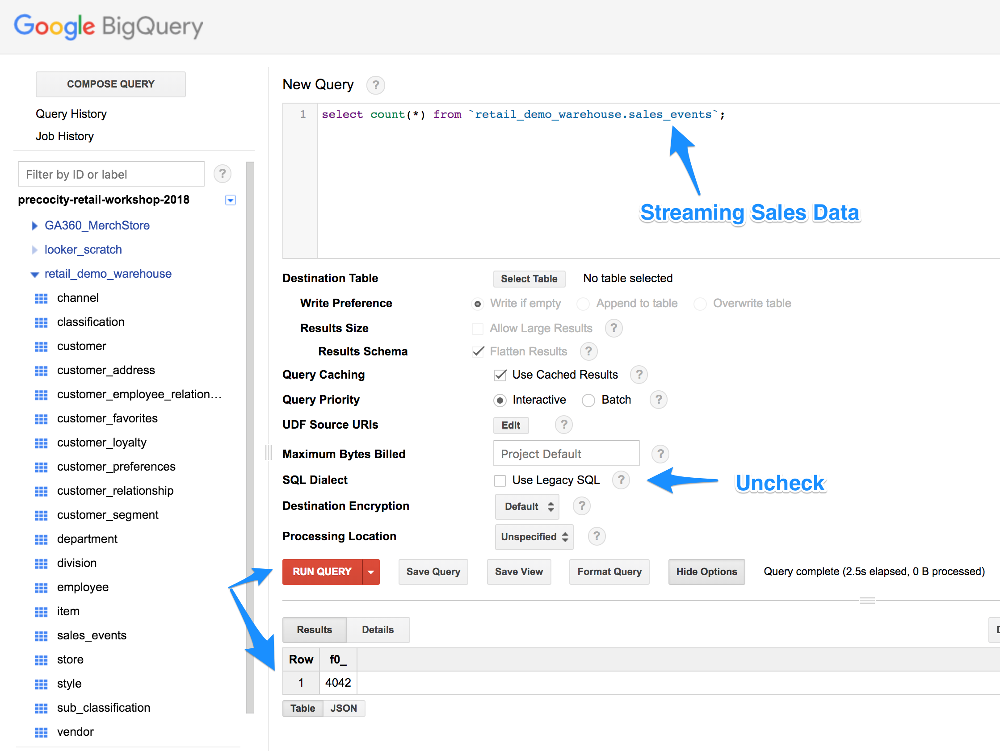

**Step 8:** In the bottom half of the page you will see "Results" and "Details" tabs. The "Results" tab presents the output of the query just executed.

**Step 9:** Click on the "Details" tab to see the cost of the executing the SQL statement, the bytes processed, the physical execution plan etc.


**Step 10 (Optional):** Next, let's execute some basic SQL statements using `gcloud`.

>**Note:** The sales events data publisher might still be running in your Cloud Shell. In order to execute the next step you might have to kill the running sales data publisher using **`Ctrl + C`**. You can restart the sales data publisher by executing `cd ~/gcp-retail-workshop-2018 && sh ingestion/scripts/02_runPublisher.sh`

**Step 11 (Optional):** Execute the following commands:
```
cd ~/
bq shell
ls retail_demo_warehouse
show --schema retail_demo_warehouse.customer
select * from retail_demo_warehouse.customer limit 5;
exit
```

**Step 12:** In this step we will execute a more realistic BQ query that will join both customer and sales data to get some metrics about the customer that can help drive the analytics. Also as part of this step we will see more detailed information about query execution plans, costs, data processed etc.

[TODO: Nicely explain what's going on in the big sql.]

1. Open the [customer_detail_demo.sql](bigquery/samples/customer_detail_demo.sql) file.
2. Copy the entire contents of this SQL file and paste it in the BigQuery > Compose Query text area.
3. Select Show Options > Uncheck "Use Legacy SQL" option.
4. Click Run Query.
5. Once the query execution is complete you will see the results in the bottom pane.

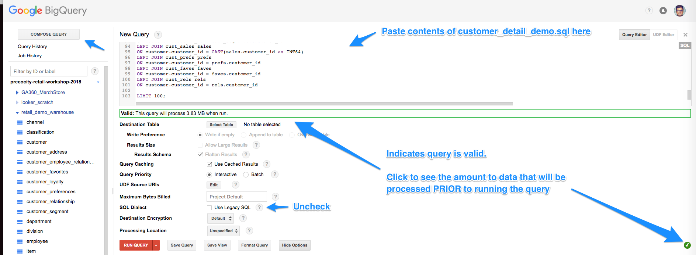

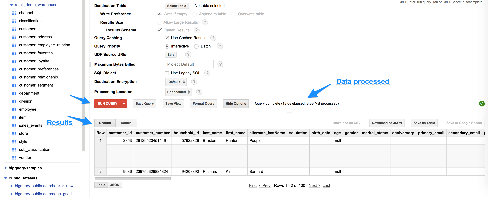

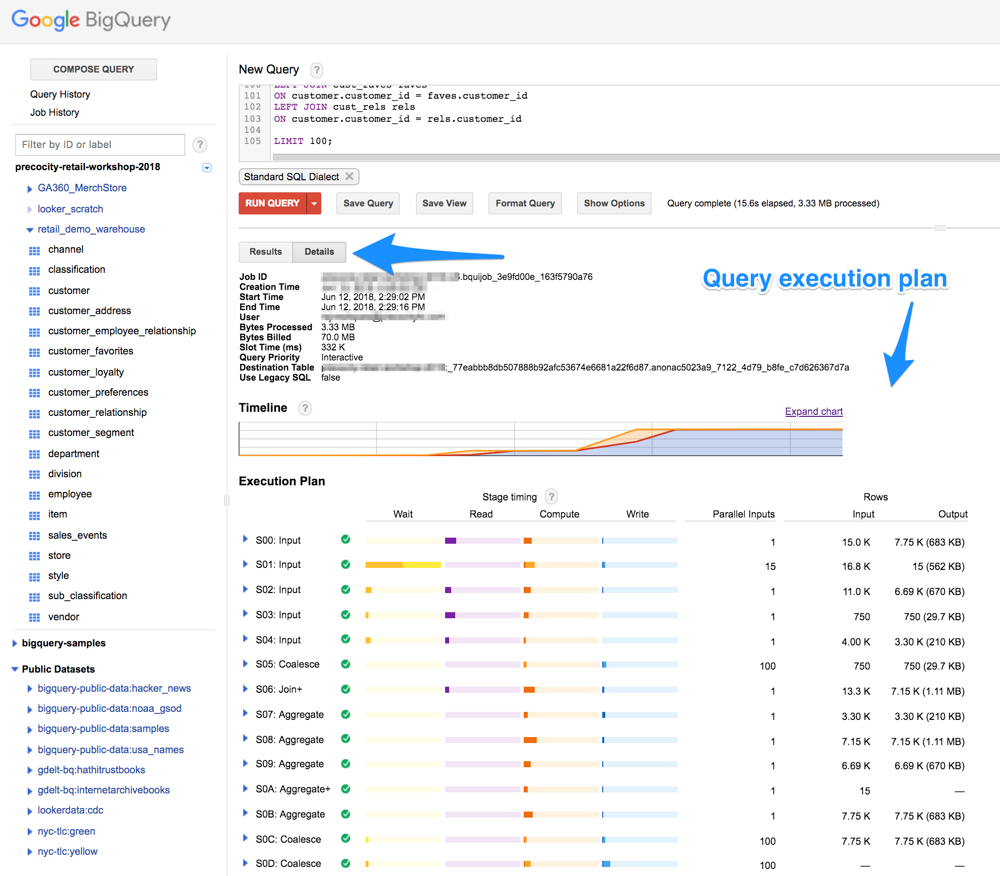

---

### Exercise: Cleanup

Expected Time: 5 mins

**Step 1:** Stop the sales event data pump that's running in the Cloud Shell using `Ctrl + C`.

**Step 2:** Stop the running Dataflow jobs. **SalesEventsStreaming** and **SalesEventsRawStreaming**.

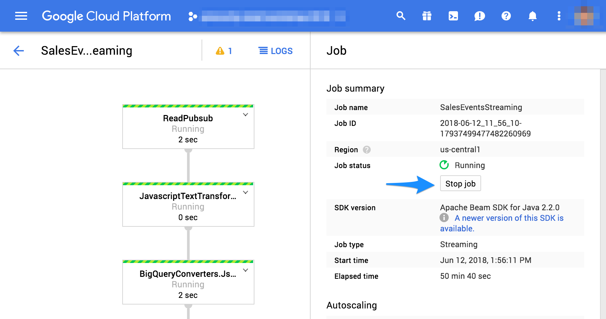

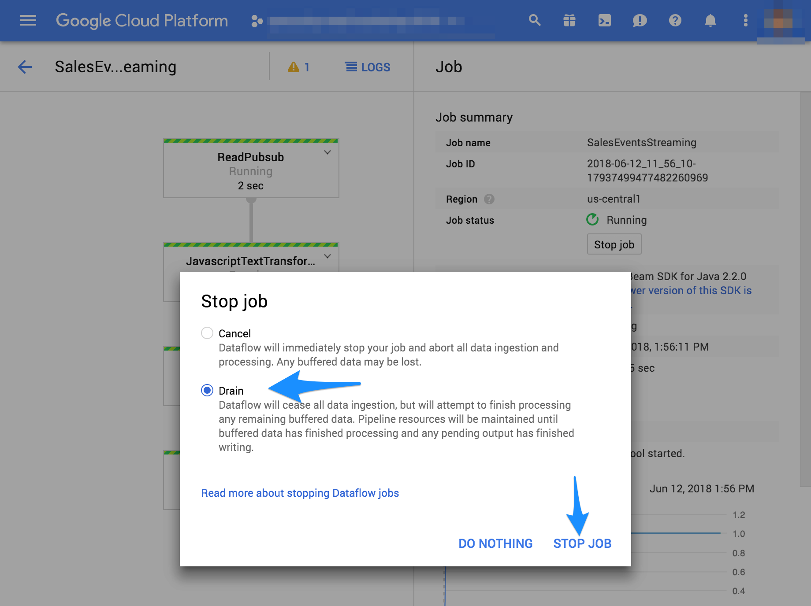

**Step 3:** Delete the **[unique-dataflow-bucket-name]** you created.

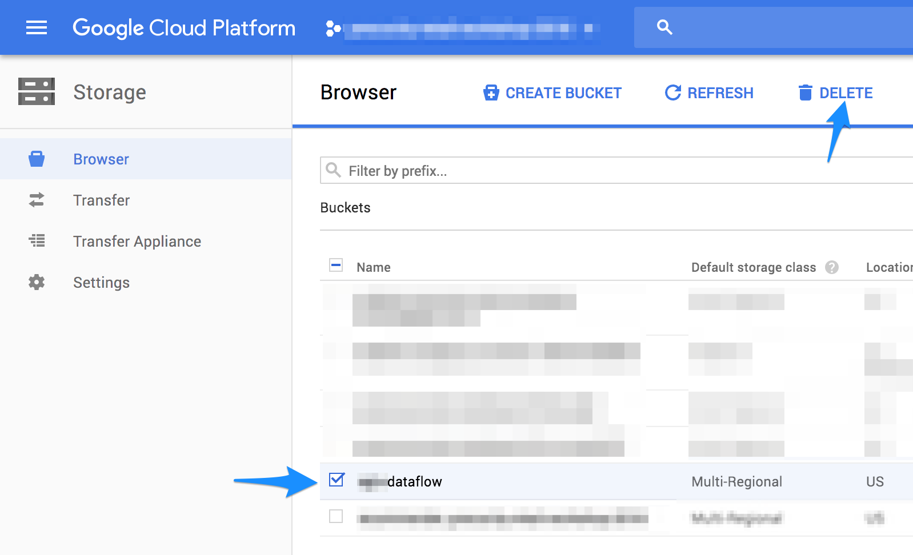

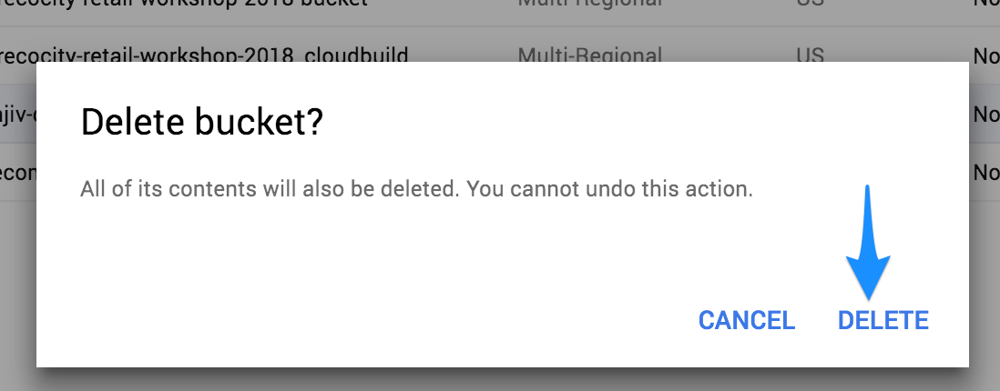

**Step 4:** Delete the dataset in BQ.

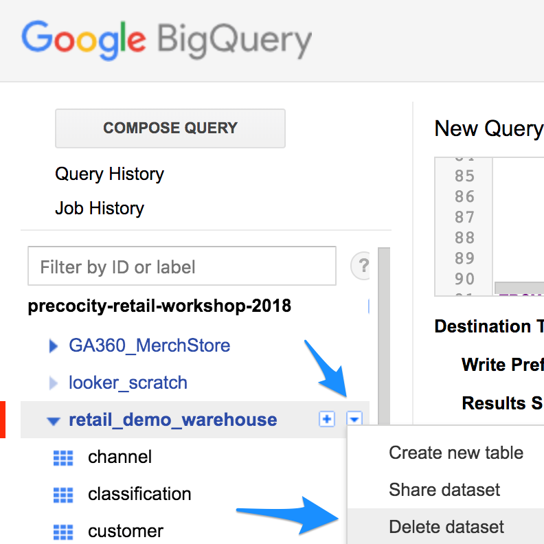

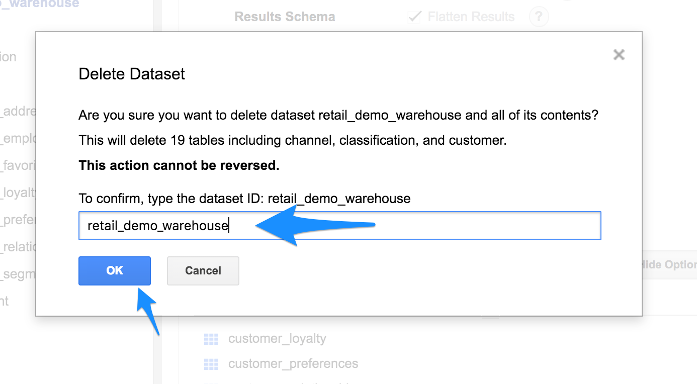

**Step 5:** Delete PubSub topic

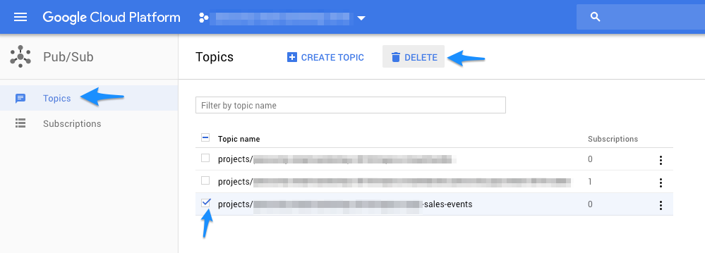
