# Data Ingestion Hands-On Lab
## Overview
### Architecture
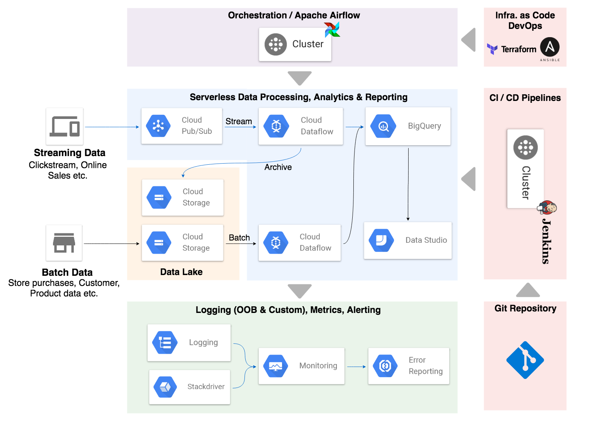
### Data Model
*[To Be Added]*

*[Identify the tables that will be loaded using Batch approach vs Streaming approach]*

### Dataflow Templates
* [Overview](https://cloud.google.com/dataflow/docs/templates/provided-templates)
* [Source code](https://github.com/GoogleCloudPlatform/DataflowTemplates)
  - GCS Text to BigQuery
  - Pub/Sub to BigQuery
  - Pub/Sub to GCS Text

## Hands-On
### Pre-Requisites
* Cloud Shell
* `git clone https://github.com/precocity/gcp-retail-workshop-2018.git`
* `cd gcp-retail-workshop-2018/ingestion`

>Tip: For the following exercises and the commands that need to be executed as part of them, it is recommended to copy the commands to a text editor first and replace the placeholders with the appropriate values and then copy-paste the updated command at the prompt.

> Note: Unless otherwise explicitly stated, all the commands below are to be executed in Cloud Shell.

---

### Exercise 1: Creating BigQuery Tables

Expected Time: TBD

Let's create one BigQuery table using the `bq` command and create the rest in the same manner using a helper script.

**Step 1:**
Create a dataset using the command below, be sure to replace the **[project-name]** before executing:

`bq mk [project-name]:retail_demo_warehouse`

>After executing this command, you should see a success message indicating that the dataset has been successfully created.

**Step 2:** Create a BigQuery table, customer, using the schema definition in the codebase:

`bq mk --table [project-name]:retail_demo_warehouse.customer bigquery/schemas/customer-bq.json`

>After executing this command, you should see a success message indicating that the table has been successfully created.

**Step 3:** Verify whether the dataset and the table are appropriately created by navigating to BigQuery on the left nav of Google Cloud home page and then selecting the dataset and table on the BigQuery home page.<br/><br/>

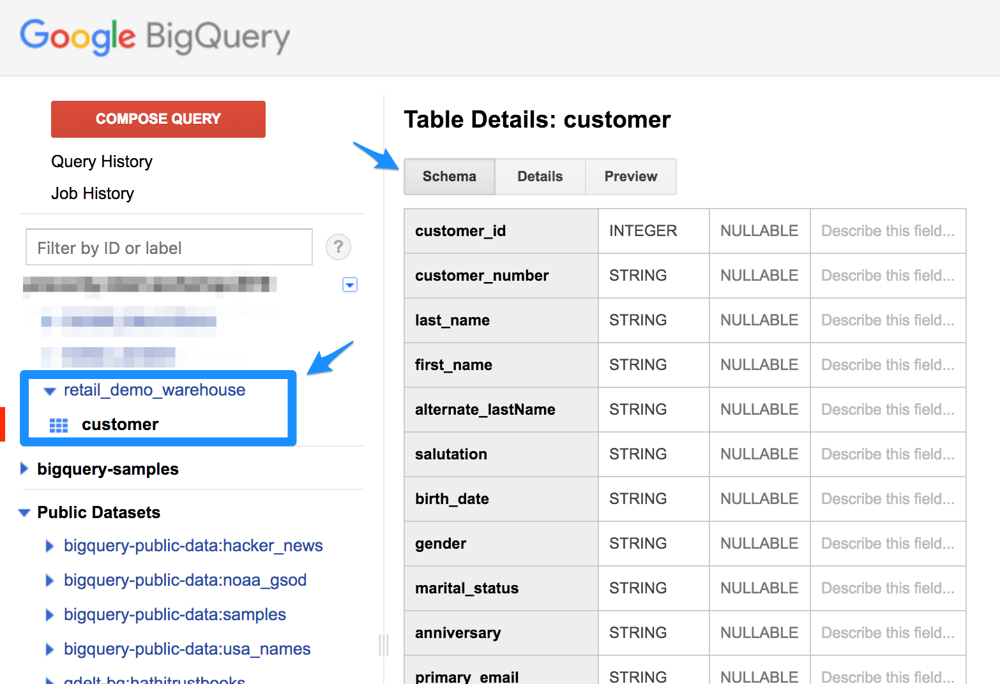

**Step 4:** Let's go ahead and create the rest of the tables required using a helper script that's provided in the codebase which essentially executes step #2 for all the remaining tables: (the required arg to this script is the **[project-name]**)

`sh bigquery/scripts/create-bq-tables.sh [project-name]`

>At this point all the tables will be created in the dataset in BigQuery. You can verify in the BigQuery home page.

---

### Exercise 2: Deploy Dataflow Jobs

Expected Time: TBD

Let's manually deploy both batch and streaming dataflow jobs using the Google provided templates to understand how they readily provide capabilities to address most common ingestion scenarios.

**Step 1:** Clone the Google provided Dataflow templates project:
```
cd ~/
git clone https://github.com/GoogleCloudPlatform/DataflowTemplates.git
cd DataflowTemplates
```

**Step 2:** Create a bucket in GCS to deploy the Dataflow jobs, be sure to replace **[unique-dataflow-bucket-name]** before you execute the command:<br/>

>**Note:** The bucket that you will be creating in this step will be used in rest of the steps_

`gsutil mb gs://[unique-dataflow-bucket-name]`

**Step 3:** Build & deploy the GCS Text -> BigQuery Dataflow job:
```
mvn compile exec:java \
-Dexec.mainClass=com.google.cloud.teleport.templates.TextIOToBigQuery \
-Dexec.cleanupDaemonThreads=false \
-Dexec.args=" \
--project=[project-name] \
--stagingLocation=gs://[unique-dataflow-bucket-name]/gcs-to-bigquery/staging \
--tempLocation=gs://[unique-dataflow-bucket-name]/gcs-to-bigquery/tmp \
--templateLocation=gs://[unique-dataflow-bucket-name]/gcs-to-bigquery/templates/FileToBigQuery.json \
--runner=DataflowRunner"
```
>You should see a "Build Successful" message upon successful deployment of the Dataflow job.

**Step 4:** Build & deploy the Pub/Sub -> BigQuery Dataflow job:
```
mvn compile exec:java \
-Dexec.mainClass=com.google.cloud.teleport.templates.PubSubToBigQuery \
-Dexec.cleanupDaemonThreads=false \
-Dexec.args=" \
--project=[project-name] \
--stagingLocation=gs://[unique-dataflow-bucket-name]/pubsub-to-bigquery/staging \
--tempLocation=gs://[unique-dataflow-bucket-name]/pubsub-to-bigquery/tmp \
--templateLocation=gs://[unique-dataflow-bucket-name]/pubsub-to-bigquery/templates/PubSubToBigQuery.json \
--runner=DataflowRunner"
```
>You should see a "Build Successful" message upon successful deployment of the Dataflow job.

**Step 5:** Build & deploy Pub/Sub -> GCS Text Dataflow job:
```
mvn compile exec:java \
-Dexec.mainClass=com.google.cloud.teleport.templates.PubsubToText \
-Dexec.cleanupDaemonThreads=false \
-Dexec.args=" \
--project=[project-name] \
--stagingLocation=gs://[unique-dataflow-bucket-name]/pubsub-to-gcs/staging \
--tempLocation=gs://[unique-dataflow-bucket-name]/pubsub-to-gcs/tmp \
--templateLocation=gs://[unique-dataflow-bucket-name]/pubsub-to-gcs/templates/PubSubToFile.json \
--runner=DataflowRunner"
```
>You should see a "Build Successful" message upon successful deployment of the Dataflow job.

**Step 6:** At this point all the required Dataflow jobs are deployed to GCS and you can verify by navigating to your bucket and the respective folders.

**Step 7:** Next step is to deploy application specific logic (parsing & transformations) that is required by the Dataflow jobs. There is helper script that copies the application specific code to GCS. Execute the following:
```
cd ~/gcp-retail-workshop-2018/ingestion
sh dataflow/scripts/deploy-app-code.sh [unique-dataflow-bucket-name]
```

---

### Exercise 3: Batch Load

Expected Time: TBD

>**Note:**
>1. You will need the project name and the name of the bucket you created in the previous exercise to continue.
>2. Be sure to enable Dataflow APIs in Google Cloud APIs page before proceeding.

>**Tip:** Copy the commands to your editor and replace the appropriate placeholders before you past them on to the console

In this exercise we will deploy a batch load job to load the customer data from GCS to the target customer table in BigQuery. We will be using the customer CSV file that's available in the workshop's bucket.

**Step 1:** Execute the following `gcloud` command to create a Dataflow job to load customer data. Be sure to replace both **[unique-dataflow-bucket-name]** and **[project-name]** with appropriate values before executing:
```
gcloud dataflow jobs run CustomerLoad \
--gcs-location=gs://[unique-dataflow-bucket-name]/gcs-to-bigquery/templates/FileToBigQuery.json \
--zone=us-central1-c \
--parameters javascriptTextTransformFunctionName=transform,\
JSONPath=gs://[unique-dataflow-bucket-name]/schemas/customer.json,\
javascriptTextTransformGcsPath=gs://[unique-dataflow-bucket-name]/udfs/customer.js,\
inputFilePattern=gs://precocity-retail-workshop-2018-bucket/staged/customer/customer.*.csv,\
outputTable=[project-name]:retail_demo_warehouse.customer,\
bigQueryLoadingTemporaryDirectory=gs://[unique-dataflow-bucket-name]/gcs-to-bigquery/tmp
```
>Following the execution of the command you should see a log in the console similar to below:
```
createTime: '2018-06-08T19:59:11.516061Z'
currentStateTime: '1970-01-01T00:00:00Z'
id: 2018-06-08_12_59_10-6953731249770254557
location: us-central1
name: CustomerLoad
projectId: precocity-retail-workshop-2018
type: JOB_TYPE_BATCH
```

**Step 2:** Navigate to the Dataflow page (GCP Home > Left Nav's Dataflow) to see the status of the job just submitted. Alternatively you can also get the job status from the command line using the command below:

`gcloud dataflow jobs list`

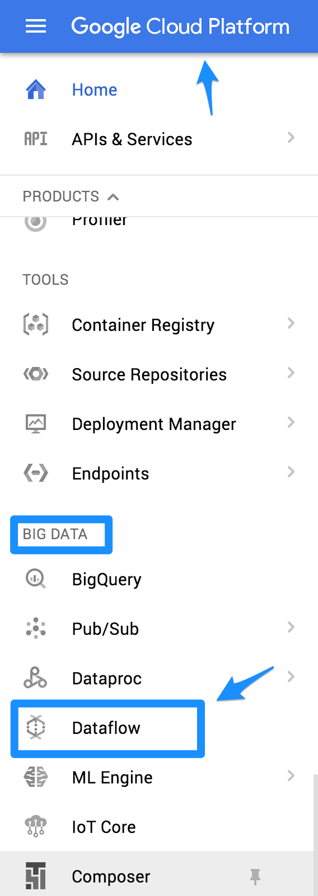
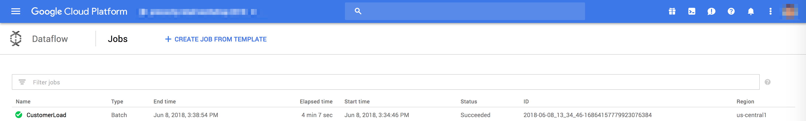

**Step 3:** In the Cloud Dataflow jobs page select the running job to see the job graph.

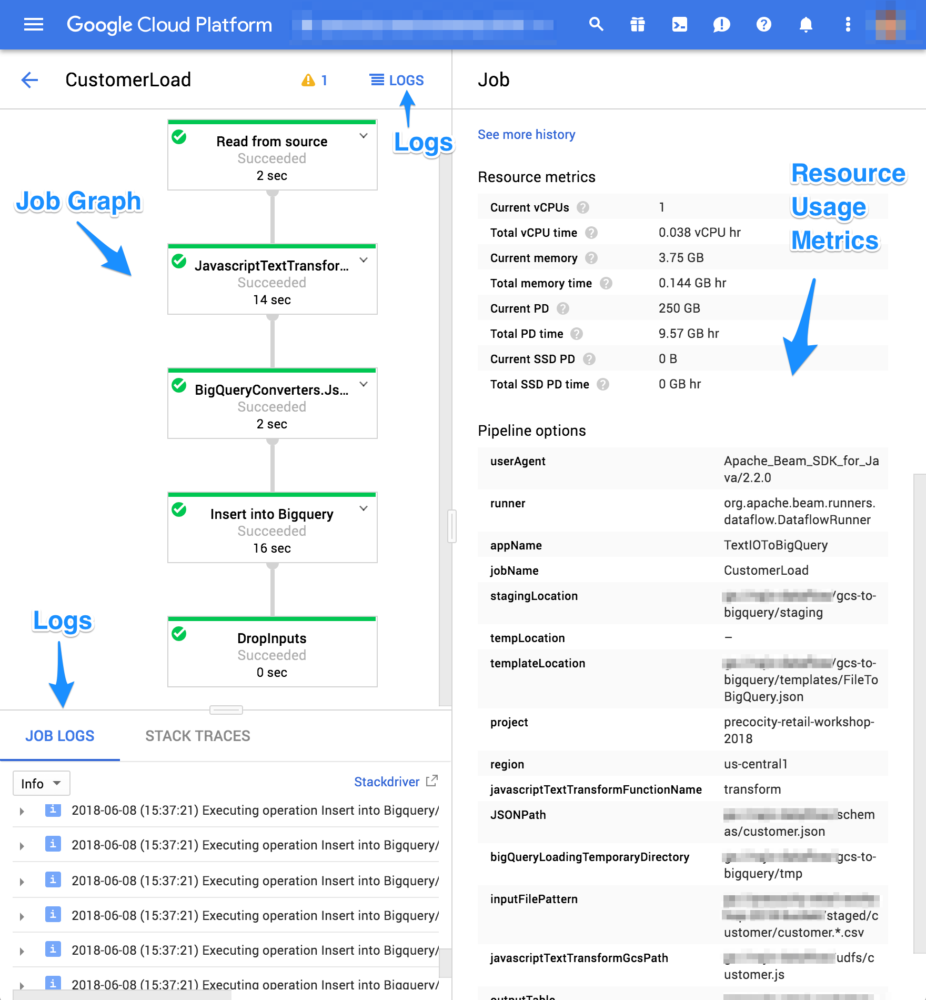

**Step 4:** You can also see the logs of each step by clicking the "Logs" icon on the job page.

**Step 5:** Once the job completes, the status of the job will be marked "Succeeded" in the Dataflow home page.

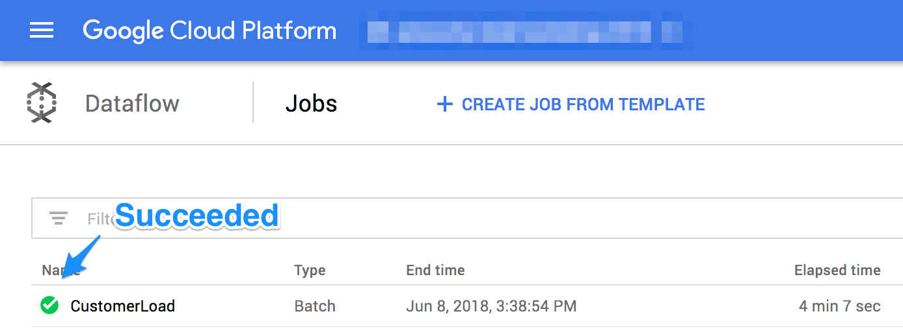

**Step 6:** Now, let's go ahead and kick off other Dataflow jobs to load the rest of the tables. There's a helper script which has all the `gcloud` commands to kick off the batch load process for the rest of the tables.

```
cd ~/gcp-retail-workshop-2018/ingestion
sh dataflow/scripts/submit-batch-jobs.sh
```

**Step 7:** While the other jobs start to run, you can verify that the `customer` table has been successfully loaded in the BigQuery page as shown below.

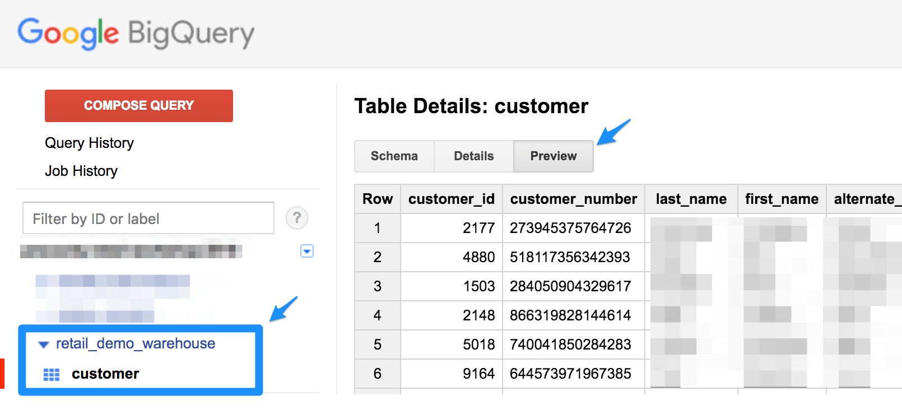

**Step 8:** You can verify the other running jobs by navigating to the Dataflow jobs page and checking the status of each batch job.

>The key takeaway with this exercise is that we only built the batch ingestion Dataflow job only once. By templatizing / parameterizing it's execution we are able to reuse the same code for ingesting multiple batch sources.

---

### Exercise 4: Streaming

Expected Time: TBD

In this exercise we will deploy a streaming job to ingest streaming / realtime data into BigQuery. We will have two Dataflow jobs:
1. Streaming realtime data into BQ
2. Archiving realtime data into GCS

TBD: Go over the format of Sales Message

**Step 1:** Create a Pub/Sub topic to publish realtime sales events.

>Note down the PubSub **[topic-name]** you are creating as it will be used in the following steps

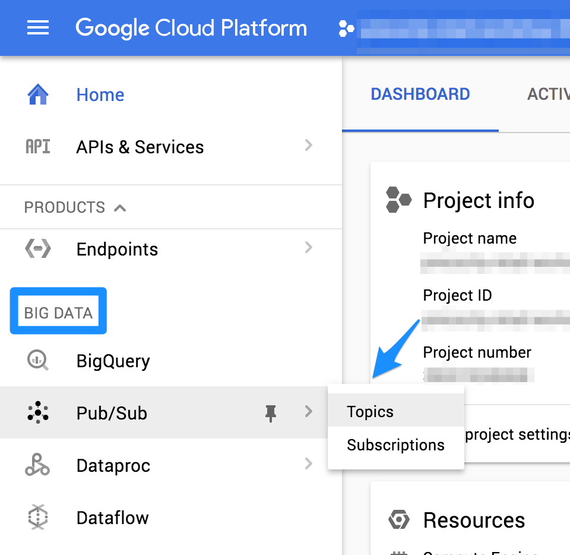
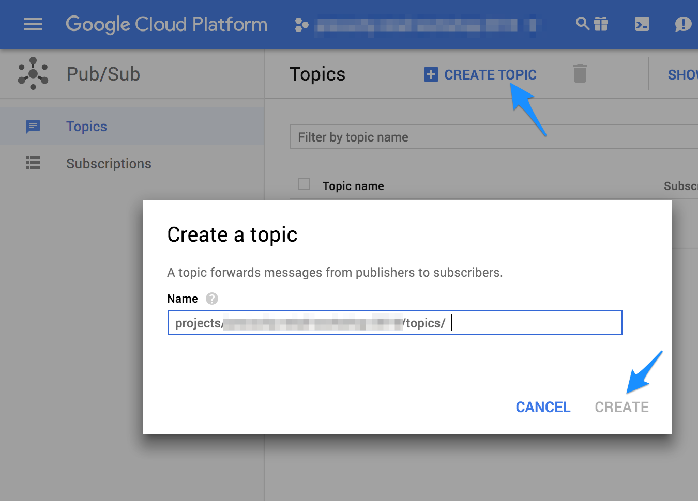

>Alternatively you can create the PubSub topic using the gcloud command too by executing the following in Cloud Shell:
> `gcloud pubsub topics create [topic-name]` and then verifying by executing:
> `gcloud pubsub topics list`

**Step 2:** Next step, let's deploy the streaming Dataflow job that will subscribe to the PubSub topic and does streaming insert into the BigQuery sales table. Be sure to replace the **[unique-dataflow-bucket-name]** with the GCS bucket you have created in the previous exercises and also the **[project-name]** and **[topic-name]**.

```
cd ~/gcp-retail-workshop-2018/ingestion
gcloud dataflow jobs run SalesEventsStreaming \
 --gcs-location=gs://[unique-dataflow-bucket-name]/pubsub-to-bigquery/templates/PubSubToBigQuery.json\
 --parameters inputTopic=projects/[project-name]/topics/[topic-name],\
 outputTableSpec=[project-name]:retail_demo_warehouse.sales_events
```

**Step 3:** Navigate to the Dataflow jobs page to notice the `SalesEventsStreaming` job running.

**Step 4:** Similarly, let's deploy the streaming Dataflow job that will subscribe to the PubSub topic and stores the raw JSON data into GCS for archival purposes. Be sure to replace the placeholders in the command below.

```
gcloud dataflow jobs run SalesEventsRawStreaming \
 --gcs-location=gs://[unique-dataflow-bucket-name]/pubsub-to-gcs/PubSubToFile.json\
 --parameters inputTopic=projects/[project-name]/topics/[topic-name],\
 outputDirectory=gs://[unique-dataflow-bucket-name]/raw/sales_events/,\
 outputFilenamePrefix=sales-events-,outputFilenameSuffix=.json.txt
```

**Step 5:** Navigate to the Dataflow jobs page and check if both the streaming jobs are running successfully

>Note: Unlike the batch jobs, the streaming Dataflow jobs run until they are terminated (either manually by going to the Dataflow job page and stopping / draining the job or programatically using the gcloud command)

**Step 6:** Next step, let us start streaming some sales events to the PubSub topic so that we can see the Dataflow jobs in action. There is a helper script to accomplish this. The below scripts takes the target PubSub **[topic-name]** as an argument:

```
cd ~/gcp-retail-workshop-2018
sh scripts/tbd.sh [topic-name]
```

**Step 7:** Navigate to the job pages to see the Dataflow jobs consume the realtime streaming sales events, process them and land them into their target destinations (BigQuery, GCS).

---

### Exercise 5: BigQuery Basics

Expected Time: TBD

We will use this exercise to validate both exercises 3 & 4 completed successfully while exploring BigQuery by executing SQL queries through both UI & the gcloud command line.

**Step 1:** First, we will make sure all the data has been correctly loaded into the BQ customer table. Navigate to the BigQuery home page (GCP Home Page > Left Nav - BigQuery)

**Step 2:** In the BQ home page, on the left side nav, select your project and the dataset and click (v) to expand and to see the list of tables. Click on the `customer` table.

**Step 3:** On the main area you will see 3 tabs, Schema, Details and Preview. Click on the Preview tab to see a preview of the data that's loaded into the customer table.


**Step 4:** Next, we will execute SQL statements both from the UI.

**Step 5:** While on the BQ home page, click on the "Compose Query" button on the left to open up the SQL editor.

**Step 6:** Click on "Show Options" and **un-check** the "SQL Dialect: Use Legacy SQL" box.

**Step 7:** In the query editor enter the following SQL query:
```
select count(*) from `retail_demo_warehouse.customer`;
```
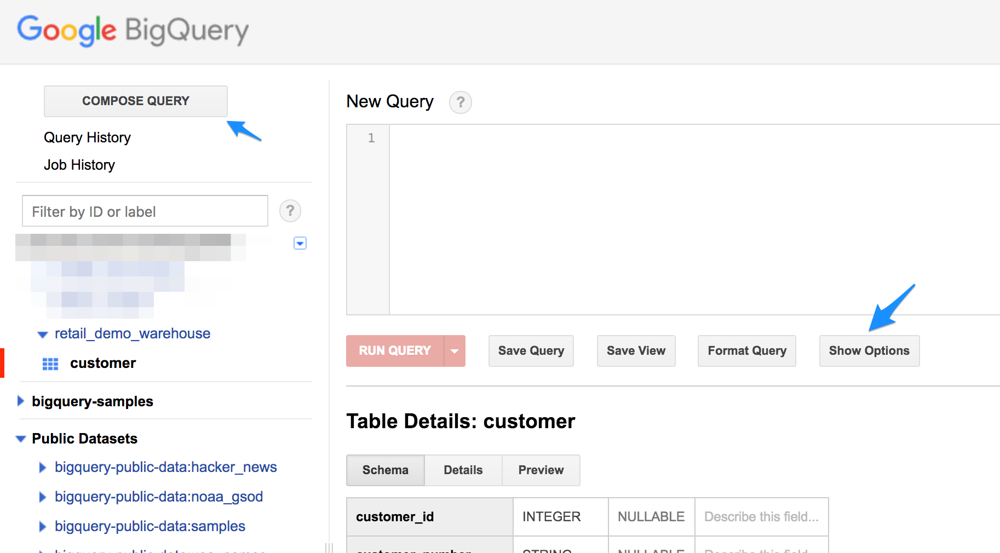

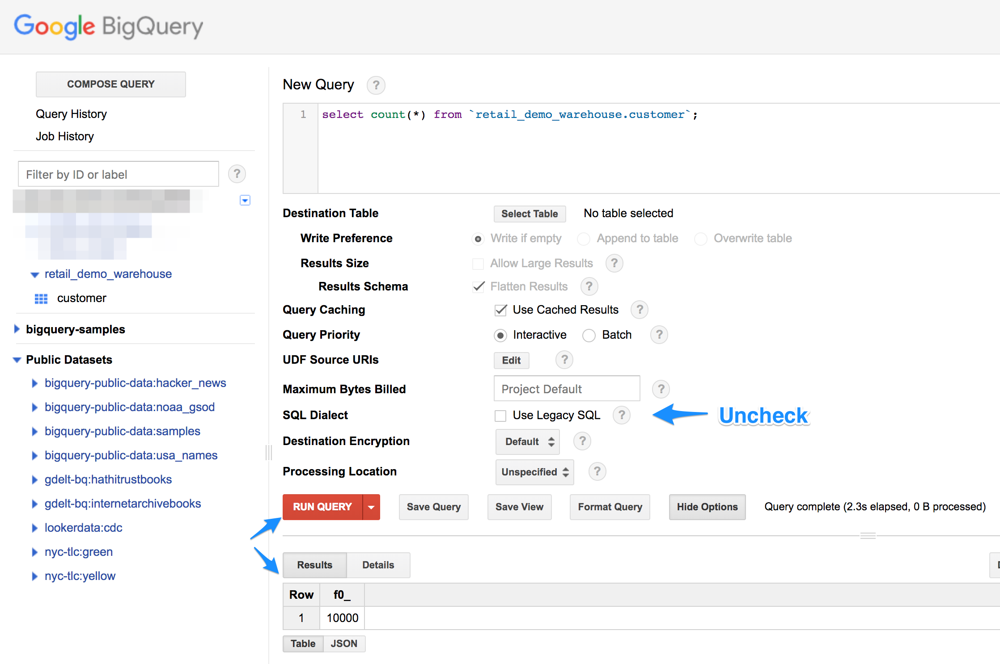

**Step 8:** In the bottom half of the page you will see "Results" and "Details" tabs. The "Results" tab presents the output of the query just executed.

**Step 9:** Click on the "Details" tab to see the cost of the executing the SQL statement, the bytes processed, the physical execution plan etc.

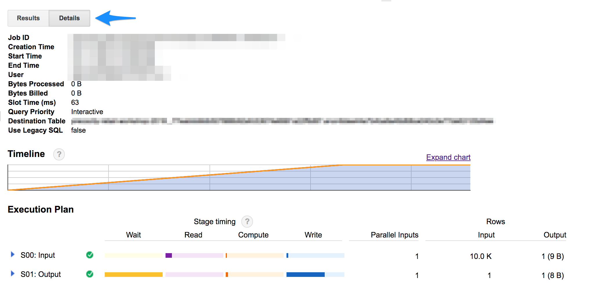

**Step 10:** Next, let's execute some basic SQL statements using `gcloud`.

**Step 11:** Execute the following commands:
```
cd ~/
bq shell
ls retail_demo_warehouse
show --schema retail_demo_warehouse.customer
select * from retail_demo_warehouse.customer limit 5;
exit
```

**Step 12:** We will next execute a SQL from a file. This is a bit more interesting usecase to [TBD usecase to show top 'x' records & the required SQL file]. Execute the below command:
```
cd ~/gcp-retail-workshop-2018/ingestion
bq query --use_legacy_sql=False `cat bigquery/samples/interesting-tbd.sql`
```
