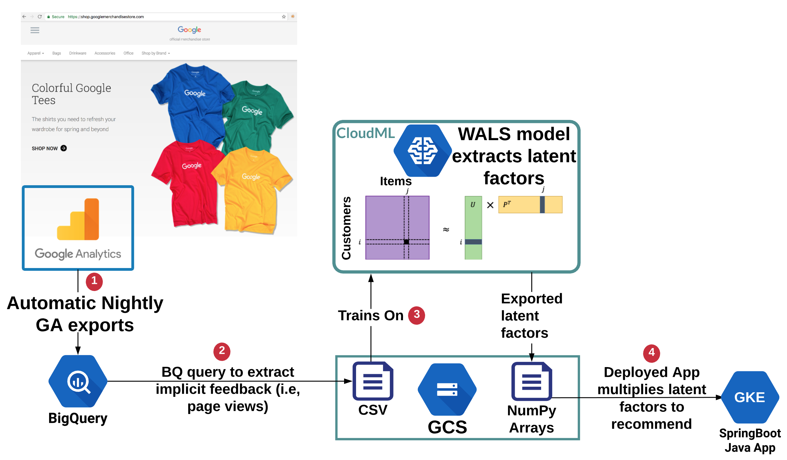
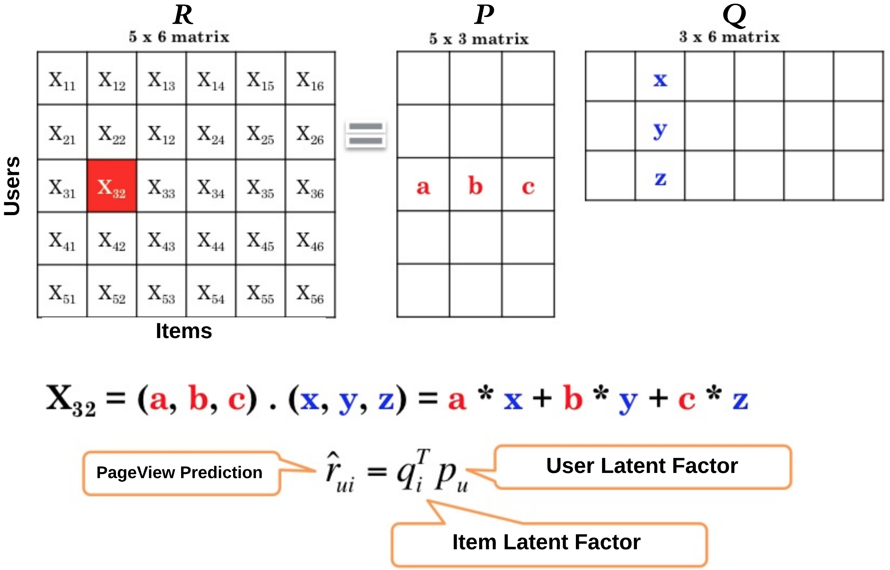

# Recommendations on GCP with TensorFlow and WALS

This README documents the process to build an end-to-end ecommerce recommender without spinning up any infrastructure, a completely managed solution using BigQuery & Cloud MLE.  The ingestion and training aspects of the build are documented in this README while the model deploymennt is documented in the `recommender_svc/java` README

## High Level Architecture

	
## Extract Data from BigQuery


1. **Prepare DataSet/Bucket:** Create a GCS bucket `$BUCKET` & BQ datset `GA360_MerchStore` to store the implicit feedback we build from BQ: 

	```sh
	BUCKET=gs://recommender_$GOOGLE_CLOUD_PROJECT
	gsutil mb ${BUCKET}
	bq mk GA360_MerchStore
	cd gcp-retail-workshop-2018/recommender
	```

2. **Implicit Feedback Query:** The following query will generate the the # of `page_views` for each `client_id`,`item_id` combo.  It selects from all 366 (1 year = 2016-08-01 - 2016-08-01) daily partitioned public BQ tables = `bigquery-public-data.google_analytics_sample.ga_sessions`.  

	```sql
	SELECT
	    fullVisitorId AS client_id,
	    hits.product.productSku AS item_id,
	    SUM(IF(hits.eCommerceAction.action_type=='6' AND hits.product.isImpression IS NULL, 1, 0)) AS page_views
	FROM
	    TABLE_DATE_RANGE(
	        [bigquery-public-data.google_analytics_sample.ga_sessions_],
	        TIMESTAMP('2016-08-01'),
	        TIMESTAMP('2017-08-01'))
	GROUP BY client_id, item_id
	HAVING 
	  client_id IS NOT NULL and page_views > 0
	```
	This query is contained in the `implicit_feedback_query.sql` file so you don't have type it in and can instead just issue it using the following bq command:
					
		bq query --replace=true --destination_table=GA360_MerchStore.implicit_feedback "`cat implicit_feedback_query.sql`"

3. **Extraction**: Extract newly created table into CSV into GCS BUCKET

	```sh
	TRAIN_FILE=$BUCKET/data/recommendation_events.csv
	bq extract GA360_MerchStore.implicit_feedback $TRAIN_FILE
	```	
		
## Train Recommender using Cloud ML Engine
Now that the training file has been prepared and stored in GCS, we're ready to train our recommender.  The recommender is located wals_ml_engine.  It takes 5-10 mins to train so let's fire it off first and then we'll exlpain and understand the details while it runs.


1. Setup some ENV variables & change directory

	```sh
	JOBNAME=wals_$(date -u +%y%m%d_%H%M%S)
	ARGS="--data-type web_views --train-files ${TRAIN_FILE} --verbose-logging $@"
	cd wals_ml_engine
	```
2. Execute Cloud MLE command:

	```sh
	gcloud ml-engine jobs submit training ${JOBNAME} \
	 --region us-east1 \
	 --scale-tier=CUSTOM \
	 --job-dir=$BUCKET \
	 --module-name trainer.task \
	 --package-path trainer \
	 --config trainer/config/config_train.json \
	 -- \
	 ${ARGS}
	```

#WALS Example

While MLE is training the model, let's discuss it a bit more in-depth.  The built in WALS model in Tensorflow is a collaborative filtering algorithm that performs matrix factorization via an alternating least squares method.  Let's break that down.  The implicit feedback we generated in `$TRAIN_FILE` forms a spare matrix of Items/Users, similar to *R* matrix below where the *X<sub>ui</sub>* entry is the # of items user *u* has viewed the detail page of item *i*.   The iterations of the WALS training process derive the latent factors *P* & *Q* by *alternating* between fixing *P* & computing *Q* and fixing *Q* and computing *P*.
	
Note, that R is very sparse and most of the *X<sub>ui</sub>* are missing and obviously WALS only trains on the observed/populated entries.   In the example below, suppose user 3 had NOT viewed item 2 and hence red entry *X<sub>32</sub>* is missing.  The predicted value for it can computed by doing the cross product of the dervied latent factors *P* & *Q*.  


#Cloud MLE Submission


		 
		 
			

