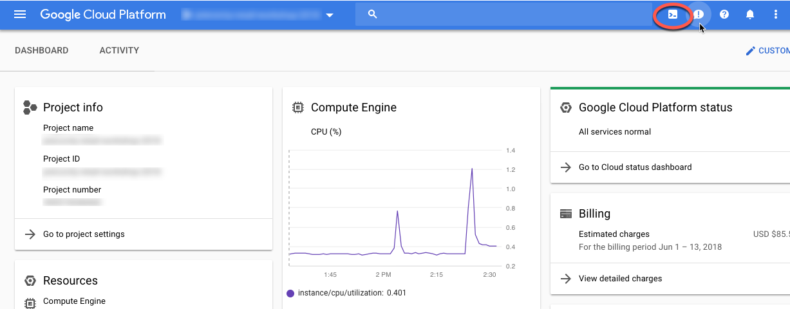

# Building and Deploying the Recommendation API Service

Once a model has been trained, it can be leveraged by an API-based service to expose the recommendations to an eCommerce platform, a mobile application or, potentially partners and affiliates.   The porttion of the workshop will be focused on creating the services the will utilize the trained model generate recommendations in real-time for a specified customer id.  

1. Open Cloud Shell in your project




2. Clone the workshop repository if you haven't already done so:

```bash
git clone https://github.com/precocity/gcp-retail-workshop-2018.git
```

3. Switch to the directory for the recommendation service component: `cd gcp-retail-workshop-2018/recommender_svc/java`

1. The next step uses Google Cloud Container builder to build the Java service and  push the containter to Google Container Repository.  The build process uses a multi-stage Dockerfile to first, compile the project in a clean and consistent environment and then create the final container image with the compiled jar file.  *Don't forget the "." at the end of the command below.*

```bash
gcloud container builds submit --tag gcr.io/$DEVSHELL_PROJECT_ID/retail-wkshp-recs .
```

5. Next we will launch a single-node GKE "cluster" that on which we'll deploy our recommendations service.  It's import to specify the cluster version number as our kubernetes manifest relies on v1.9 or greater.  It will take 1-3 minutes for the cluster to deploy and become accessible.

```bash
gcloud container clusters create retail-wrkshp-k8s \
  --zone us-central1-a \
  --num-nodes 1 \
  --cluster-version=1.10.2 \
  --scopes=storage-ro
```

6. Once the cluster has deployed, we'll use the gcloud command to grab the credentials and configure `kubectl`:

```bash
gcloud container clusters get-credentials retail-wrkshp-k8s --zone us-central1-a
```

7. One of the ways to store configuration information in the Kubernetes ecosystem is to use ConfigMaps.  This allows you to load configuration information into the cluster separately from any deployments that might depend on it.  In this case, our Spring Boot-based recommendation service looks for environment variables that are set as part of our deployment manifest.  Create the config map using your project id and associated gcs bucket as per the command below:

```bash
kubectl create configmap recs-svc-config --from-literal=gcp.project=$DEVSHELL_PROJECT_ID --from-literal=gcs.bucket=recommender_$DEVSHELL_PROJECT_ID
```

8. Edit the `k8s/deployment.yml` file (using sed find/replace) to reference the correct image for your specific google project:

```bash
sed -i -e 's/MY_PROJECT_ID/$DEVSHELL_PROJECT_ID/g' k8s/deployment.yml
```

9. Deploy the application to the cluster.  You can reference the workloads tab in the console to check on the status of the deployment.  Once the service is green as per the screenshot below, you're service is up and running.  It should be noted that we are exposing the service using NodePort which means that we are exposing a specific port for each node on which a pod is running.  This is fine for simple examples that are running on a single node cluster, but production workloads should prefer the [LoadBalancer](https://kubernetes.io/docs/concepts/services-networking/service/#publishing-services-service-types) or [Ingress](https://kubernetes.io/docs/concepts/services-networking/ingress/) methods.   

```bash
kubectl apply -f ./k8s/deployment.yml
```


10. Open the firewall to allow for external traffic to the service:

```bash
gcloud compute firewall-rules create allow-k8s-rec-svc \
  --allow=tcp:30333 \
  --description="Allow access to the product recommendation service" \
  --source-ranges=0.0.0.0/0 
```

11. Get the external IP address of the cluster node as follows:

```bash
kubectl describe nodes | grep ExternalIP
```

12.  Test the service by pastsing the following URL in your browser to retrieve the recommendations for a given customer id.  Note that using curl/wget from cloud shell will not work as there are restrictions on outgoing ports (30333 is not among the allowed ports):

`http://<EXTERNAL IP>:30333/api/customer/0010944918137684580/recs?numRecs=8`
